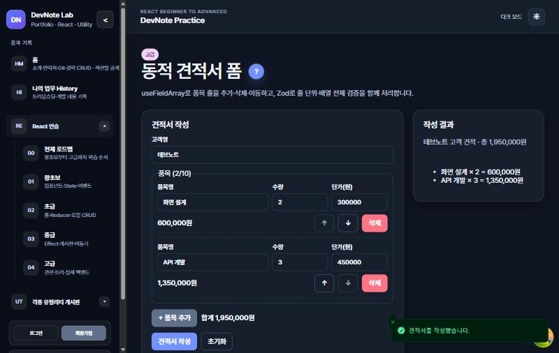
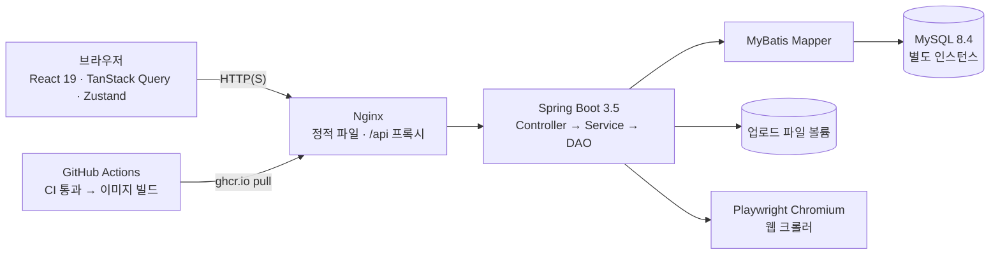

# DevNote

[](https://github.com/Noono0/2026_08_react_spring_devnote/actions/workflows/continuous-integration.yml)

React 19·TypeScript·Spring Boot·MyBatis·MySQL로 만든 포트폴리오와 단계별 CRUD 학습 프로젝트입니다. 직접 운영하는 포트폴리오·업무 기록 사이트이자, React를 왕초보부터 고급까지 25단계로 연습하는 실습장이고, 매일 쓰는 개발 도구 모음입니다.

| React 학습 로드맵 | API Workspace | 동적 견적서 폼 |
|---|---|---|
|  |  |  |

## 한눈에 보기

- **포트폴리오·업무 History**: 블록형 포트폴리오 편집기(추가·정렬·공개 설정)와 Tiptap 리치 텍스트 업무 기록. 슈퍼관리자 세션 로그인으로만 편집합니다.
- **React 학습 25단계**: `useState`부터 TanStack Query 낙관적 업데이트, 무한 스크롤, `useFieldArray`, Context 보호 라우트, React 19 Actions, 커스텀 훅·성능 측정·Zustand·URL 상태·ref·`use()`·테스트 작성까지. 모든 화면에 `?` 학습 가이드가 있습니다.
- **개발 도구 20여 종**: API Workspace(Collection·Runner·OpenAPI 가져오기), Regex·JSONPath·Diff·JWT·Cron, Diagram Designer(ERD↔SQL), Playwright 웹 크롤러(단계 편집·녹화·이전 실행 비교).
- **운영**: GitHub Actions에서 CI가 통과한 커밋만 이미지로 만들어 Oracle Cloud Always Free 2대(앱·DB)에 배포합니다.
- **테스트**: 프론트엔드 Vitest·Testing Library, 백엔드 JUnit·Testcontainers MySQL, 저장소 정적 검사.



### 트러블슈팅 사례

실제로 겪은 문제를 현상 → 원인 → 해결 → 결과로 정리했습니다. 전체는 [트러블슈팅 사례](docs/troubleshooting.md)에 있습니다.

- [매물 금액 `2억 2,400만원`이 `20002`로 저장된 파서 버그](docs/troubleshooting.md#1-매물-금액이-잘못-저장됨)와 실제 데이터 기반 회귀 테스트
- [Docker 환경에서만 1MB가 넘는 업로드가 실패한 원인](docs/troubleshooting.md#2-1mb가-넘는-파일만-업로드-실패)(Nginx와 Spring의 한도 불일치)
- [첫 화면 JS 1,078kB → 약 472kB](docs/troubleshooting.md#3-첫-화면-js-1078kb), 지연 로딩과 페이지 오류 화면
- [안 쓰는 업로드 파일을 정리하다 본문 이미지를 지울 뻔한 함정](docs/troubleshooting.md#4-안-쓰는-업로드-파일-정리의-함정)
- [로컬 새 DB에서만 글 저장이 실패한 원인](docs/troubleshooting.md#6-새-db에서만-글-저장이-500-오류)(Hibernate `update`가 컬럼 기본값을 지움)

## 문서 안내

| 목적 | 문서 |
|---|---|
| 처음 접속한 사용자의 화면별 사용 방법과 문제 해결 | [사용설명서](docs/user-guide.md) |
| 설치, Docker·로컬 실행, 환경변수, 문제 해결 | [실행 가이드](docs/local-development.md) |
| 학습 로드맵, 화면별 기능, API Workspace | [기능·학습 가이드](docs/learning-guide.md) |
| 크롤러 설정, 로그인 세션, 단계 실행 | [크롤러 가이드](docs/crawler.md) |
| 테스트와 정적 검사, 필요한 개발 도구 | [검증 가이드](docs/verification.md) |
| ERD·순서도 편집 | [Diagram Designer](docs/diagram-designer.md) |
| 서버 배포와 백업 | [배포 가이드](docs/deployment.md) |
| 실제로 겪은 문제와 해결 과정 | [트러블슈팅 사례](docs/troubleshooting.md) |
| 변경 기록, 검증 결과, 다음 작업 시 주의점 | [유지보수 기록](docs/maintenance.md) |
| 에이전트 작업 규칙 | [AGENTS.md](AGENTS.md) |

## 빠른 실행

Docker Desktop 또는 Docker Engine + Compose v2를 실행한 뒤 저장소 루트에서 진행합니다.

```powershell
# Windows PowerShell — .env가 없을 때만 생성
if (-not (Test-Path .env)) { Copy-Item .env.example .env }
docker compose up --build -d
docker compose ps
```

macOS/Linux에서는 `./start-docker.sh`, Windows에서는 `start-docker.cmd`로 같은 과정을 실행할 수 있습니다.

| 서비스 | 기본 주소 |
|---|---|
| 프론트엔드 | <http://localhost:3000> |
| 백엔드 상태 | <http://localhost:8080/actuator/health> |
| API 문서 | <http://localhost:8080/swagger-ui/index.html> |

로컬 소스 수정에는 **JDK 21**, **Node.js 22.13 이상**(의존성은 Corepack의 pnpm으로 설치), Docker가 필요합니다. Windows에서는 `start-local-backend.cmd`로 개발용 MySQL·백엔드·Vite를 실행할 수 있습니다. 이 스크립트는 전체 Compose 앱을 종료하고 별도 개발용 DB 볼륨을 사용하므로 [실행 가이드](docs/local-development.md)를 먼저 확인하세요.

종료는 `docker compose down`입니다. `-v`는 저장된 DB와 업로드 볼륨까지 지우므로 일반 종료에 붙이지 않습니다.

## 사이트 구성과 로그인

- `/`: 소개, 자유 글, 이미지, 기술, 경력, 프로젝트, 교육, 자격·인증과 연락처를 원하는 순서로 배치하는 자체 제작 블록형 포트폴리오입니다. 슈퍼관리자는 블록을 추가·수정·복제·삭제·정렬하고 각각 공개 또는 비공개로 전환할 수 있습니다. 프로젝트 블록은 기술 스택·역할·저장소·데모 링크를 갖고, `/projects/{번호}` 상세 화면으로 이어집니다. `PDF로 저장` 버튼은 인쇄용 화면(메뉴·편집 버튼 숨김)으로 이력서처럼 저장합니다.
- `/history`: 트러블슈팅과 개발 경험을 기록하는 공개 업무 History입니다. 기존 문서 에디터의 이미지 붙여넣기·드래그 앤 드롭·첨부파일을 재사용하며, 글마다 태그를 붙이고 목록 위 태그 버튼으로 거를 수 있습니다.
- `/react`: 왕초보·초급·중급·고급 필터와 기존 React 학습 로드맵입니다.
- `/utilities`: API Workspace부터 Regex, Formatter, Converter, Diff, JWT, Markdown, 테스트 데이터, 회원별 Snippet, Cron, Quick Tools와 서버 공유 토픽 투표까지 제공합니다.
- `/admin`: 관리자와 슈퍼관리자에게만 보이는 회원·등급·권한·일간·월간 방문 통계와 최근 이용 이력 메뉴입니다.

데스크톱 내비게이션은 별도 상단 메뉴 없이 하나의 왼쪽 사이드바로 통합합니다. 홈·업무 History, React 전체 로드맵과 왕초보·초급·중급·고급, 구현된 유틸리티 화면을 같은 메뉴에서 이동하며 관리자 항목은 관리자 역할에만 추가로 표시됩니다. 모바일에서는 화면 폭을 확보하기 위해 햄버거 버튼으로 이 사이드바를 엽니다.

비회원도 공개 화면과 유틸리티를 사용할 수 있습니다. 가입 회원은 `BRONZE`·`USER`로 시작하며 등급은 `BRONZE`, `SILVER`, `GOLD`, `PLATINUM`, `DIAMOND`, 역할은 `USER`, `ADMIN`, `SUPER_ADMIN`을 사용합니다. 포트폴리오와 업무 History 편집 버튼은 로그인한 `SUPER_ADMIN`에게만 표시됩니다.

로컬 초기 슈퍼관리자는 `admin / admin1234`입니다. 별도의 포트폴리오 편집 비밀번호는 사용하지 않습니다. 외부 배포 전에는 `.env`의 `INITIAL_SUPER_ADMIN_PASSWORD_HASH`를 교체하고 HTTPS 환경에서는 `SESSION_COOKIE_SECURE=true`로 설정해야 합니다. 로그인은 HttpOnly·SameSite 쿠키 세션으로 유지합니다. 로그인 모달의 `아이디 기억`은 ID만 브라우저에 저장하고, `자동 로그인`은 비밀번호를 저장하지 않은 채 세션 쿠키와 서버 세션 만료를 최대 30일로 연장합니다. 명시적으로 로그아웃하면 자동 로그인 쿠키는 즉시 만료됩니다.

## 소스 구조

```text
frontend/src/
  app/       공통 레이아웃·라우팅·전역 UI 상태
  features/  기능별 페이지·컴포넌트·API·타입
  shared/    HTTP·오류·알림·모달·검증 유틸리티
  mocks/     MSW 더미 API
backend/src/
  main/java/com/example/devnote/   Controller → Service → DAO
  main/resources/mybatis/mapper/  MyBatis SQL
  test/java/                      단위·MySQL 통합 테스트
docs/       용도별 문서와 유지보수 기록
http/       수동 API 요청 예제
scripts/    정적 검사·배포·백업 도구
```

학습 화면의 반복 구현은 단계별 React 개념을 보여 주기 위한 것입니다. 실제 공통 처리인 HTTP, 모달, 알림, 저장 데이터 검증은 공유합니다. 홈 외의 페이지와 포트폴리오 편집기는 필요한 시점에 불러옵니다.

## 검증

프론트엔드는 `frontend/`에서 `npm run lint`, `npm run typecheck`, `npm run test`, `npm run build`를 실행합니다. 백엔드는 `backend/`에서 Windows는 `gradlew.bat test`, macOS/Linux는 `./gradlew test`를 실행합니다.

정적 검사(Python)는 GitHub Actions가 PR과 `main`·`develop` 푸시 때 자동으로 실행하므로 로컬 설치는 선택입니다. 로컬에서 직접 돌리려면 Python 3.10 이상·PyYAML·Node.js·JDK 21·Bash가 필요합니다. 설치와 실행 명령, 외부 크롤러 테스트의 조건은 [검증 가이드](docs/verification.md)에 모았습니다. 실제 완료한 검증과 남은 제한은 [유지보수 기록](docs/maintenance.md)에 기록합니다.

버전의 기준은 `frontend/package.json`, `backend/build.gradle`, Gradle wrapper 설정입니다. 문서에 버전 표를 중복 유지하지 않습니다.
