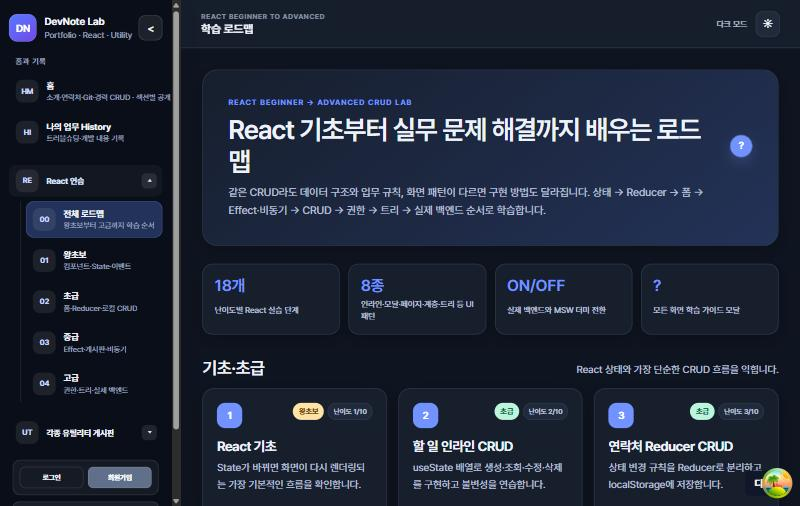
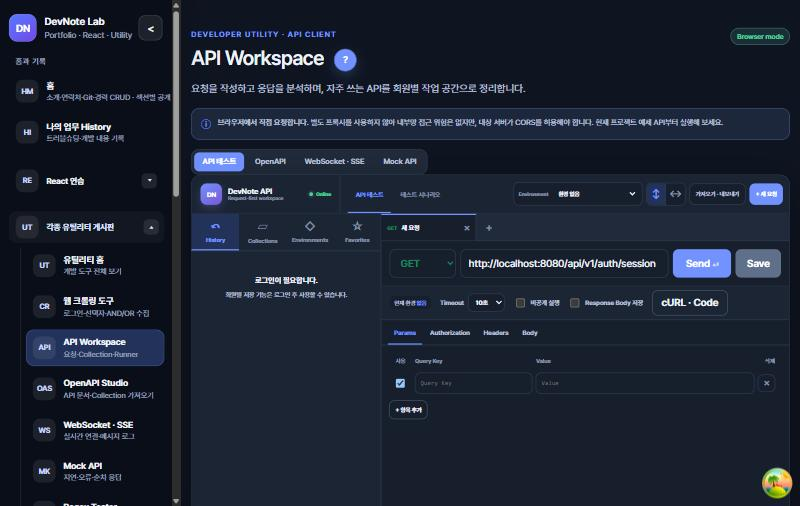

# DevNote 사용설명서

[문서 목록으로](../README.md) · [실행·설정 가이드](local-development.md) · [크롤러 상세 가이드](crawler.md) · [기능·학습 가이드](learning-guide.md)

이 문서는 사이트를 **사용하는 사람**을 위한 안내입니다. 설치 명령과 코드 구조를 모두 읽지 않아도, 화면에서 무엇을 눌러야 하는지 따라갈 수 있도록 작성했습니다. 각 기능 화면의 제목 옆 `?`를 누르면 해당 기능의 사용 순서와 주의사항을 팝업에서도 볼 수 있습니다. 화면과 문서를 대조한 기준일은 2026-10-05입니다. 버튼 이름이나 화면 구성이 이후 변경되었다면 실제 화면을 우선 확인해 주세요.

## 목차

1. [처음 실행하고 접속하기](#1-처음-실행하고-접속하기)
2. [화면 구성과 로그인](#2-화면-구성과-로그인)
3. [포트폴리오와 업무 History](#3-포트폴리오와-업무-history)
4. [React 학습 화면](#4-react-학습-화면)
5. [웹 크롤링 도구](#5-웹-크롤링-도구)
6. [API Workspace와 개발 도구](#6-api-workspace와-개발-도구)
7. [Diagram Designer와 관리자 화면](#7-diagram-designer와-관리자-화면)
8. [데이터 보관 위치와 주의사항](#8-데이터-보관-위치와-주의사항)
9. [문제가 생겼을 때](#9-문제가-생겼을-때)

## 1. 처음 실행하고 접속하기

이미 실행 중인 사이트를 사용한다면 이 절을 건너뛰고 [화면 구성과 로그인](#2-화면-구성과-로그인)부터 읽으면 됩니다.

### Docker로 처음 실행

1. Docker Desktop을 실행합니다.
2. 프로젝트 루트에서 PowerShell을 열고 아래 명령을 실행합니다. `.env`가 이미 있다면 덮어쓰지 않습니다.

   ```powershell
   if (-not (Test-Path .env)) { Copy-Item .env.example .env }
   docker compose up --build -d
   docker compose ps
   ```

3. `devnote-mysql`과 `devnote-backend`가 `healthy`, `devnote-frontend`가 `running`인지 확인합니다.
4. 브라우저에서 <http://localhost:3000>을 엽니다. 백엔드 상태는 <http://localhost:8080/actuator/health>에서 확인할 수 있습니다.

소스를 고치면서 사용하는 Windows 개발 환경은 저장소 루트의 `start-local-backend.cmd`를 실행한 뒤 <http://localhost:5173>에 접속합니다. 이 스크립트는 Docker 전체 앱을 종료하고 **별도 개발용 MySQL 볼륨**을 사용하므로, 3000 포트에서 보던 데이터가 5173 포트에서 자동으로 나타나지는 않습니다. 자세한 준비 과정은 [실행·설정 가이드](local-development.md#로컬-개발-실행-방법)를 참고하세요.

일반 종료는 `docker compose down`입니다. `docker compose down -v`는 DB와 업로드 파일 볼륨을 삭제하므로 데이터 초기화가 목적일 때만 사용하세요.

## 2. 화면 구성과 로그인

데스크톱에서는 왼쪽 사이드바, 모바일에서는 햄버거 버튼으로 메뉴를 엽니다. 주요 메뉴는 다음과 같습니다.

| 메뉴 | 주로 하는 일 |
|---|---|
| 홈과 기록 | 포트폴리오 보기, 프로젝트 상세 보기, 업무 History 읽기 |
| React 연습 | 로드맵을 따라 단계별 CRUD와 React 개념 실습 |
| 각종 유틸리티 게시판 | 크롤링, API 요청, 데이터 변환, 다이어그램 등 사용 |
| 관리자 | 회원·등급·권한 계획·방문 통계 관리. 권한에 따라 표시 |

공개 화면은 로그인하지 않아도 볼 수 있습니다. 학습 화면 상단의 `?`에는 **사용 방법 → 학습 내용 → 소스 흐름 → 실습 과제** 탭이 있고, 유틸리티의 `?`에는 해당 도구의 도움말이 있습니다. 라이트/다크 모드와 사이드바 접힘 상태는 현재 브라우저에 기억됩니다.

### 로그인과 회원가입

1. 사이드바의 `로그인` 또는 `회원가입`을 누릅니다.
2. 아이디와 비밀번호를 입력합니다. 회원가입을 하면 바로 로그인됩니다.
3. 로그인 모달의 `아이디 기억`은 **아이디만** 브라우저에 저장합니다. `자동 로그인`은 비밀번호를 저장하는 기능이 아니라 서버 세션을 최대 30일 유지하는 옵션입니다. 로그아웃하면 자동 로그인은 해제됩니다.

로컬에 새로 만든 DB의 초기 슈퍼관리자 계정은 `admin / admin1234`입니다. 개발 환경에서만 사용하고 외부에 공개하기 전에는 반드시 초기 비밀번호 해시를 바꾸세요. 이미 생성된 DB는 `.env` 값만 바꿔도 기존 관리자 비밀번호가 자동 변경되지는 않습니다. [배포 가이드](deployment.md#5-관리자-비밀번호-해시-생성--건너뛰지-마세요)를 참고하세요.

| 사용자 | 가능한 작업의 예 |
|---|---|
| 방문자 | 공개 포트폴리오·History 읽기, React 실습과 공개 유틸리티 사용 |
| 로그인 회원 | 회원별 Snippet·API Workspace 저장 기능, 투표 생성 등 사용 |
| `ADMIN` | 관리자 메뉴 조회, 투표 관리, 방문 통계 확인 |
| `SUPER_ADMIN` | 포트폴리오·History 편집, 회원·등급·권한 계획 변경 |

메뉴가 보이는 것과 실제 권한은 별개이며 서버가 최종 확인합니다. `권한관리` 화면의 토글은 현재 **표시용 계획**으로 저장되며 실제 접근 규칙을 바꾸지 않습니다.

## 3. 포트폴리오와 업무 History

### 포트폴리오 둘러보기

1. 사이드바에서 `홈`을 엽니다.
2. 소개·경력·기술·프로젝트 등 공개 블록을 아래로 내려가며 봅니다.
3. 프로젝트 카드의 `자세히 보기`를 누르면 기술 스택, 담당 역할, 저장소·데모 링크와 전체 설명을 볼 수 있습니다.
4. `PDF로 저장`은 브라우저 인쇄 창을 엽니다. 대상 프린터를 **PDF로 저장**으로 선택하면 인쇄용 화면을 파일로 받을 수 있습니다. PDF 파일을 서버에 저장하는 기능은 아닙니다.

슈퍼관리자로 로그인하면 `+ 블록 추가` 또는 블록 사이의 `+`를 눌러 종류를 고르고 내용을 입력할 수 있습니다. 빈 입력칸에 커서가 있지 않을 때 `/` 키로 블록 선택창을 열 수도 있습니다. 각 블록에서 수정·복제·삭제·공개/비공개를 선택하고, `↑`·`↓` 또는 드래그 핸들로 순서를 바꿉니다. **작성·수정 대화상자의 저장 버튼을 누르기 전에는 해당 편집 내용이 저장되지 않습니다.** 이미지 업로드 후에는 블록 저장까지 완료했는지 확인하세요.

### 업무 History 읽고 작성하기

1. `나의 업무 History`에서 제목·본문 검색, 상태·정렬, 태그 버튼으로 글을 찾습니다. 검색 조건은 주소에 반영되어 링크로 다시 열 수 있습니다.
2. 글을 열면 본문, 대표 이미지, 첨부파일을 볼 수 있습니다. 방문자는 발행된 글만 봅니다.
3. 슈퍼관리자는 `History 작성`을 누르고 제목, 상태(`임시저장`·`발행`·`보관`), 태그, 본문을 입력합니다. 태그는 쉼표로 나누며 최대 10개입니다.
4. 대표 이미지나 첨부파일을 선택하고 `문서 등록`을 누릅니다. 본문에는 이미지를 붙여넣거나 끌어다 놓을 수도 있습니다.
5. 기존 글의 `수정`에서는 필요하면 `변경 요약`을 입력하고 `수정 저장`을 누릅니다. 다른 창에서 먼저 수정했다면 버전 충돌(409)이 날 수 있습니다. 이때 상세 화면을 다시 불러와 최신 내용을 확인하세요.

`React 연습 → 문서·이미지 게시판`은 같은 문서 편집 흐름을 연습하는 별도 화면입니다. 작업 중 메뉴를 이동하기 전에 저장 여부를 직접 확인하세요. 현재 문서 편집기는 브라우저 탭을 닫거나 새로고침할 때 경고할 수 있지만, **사이트 내부 메뉴 이동을 모두 막아 주지는 않습니다.**

## 4. React 학습 화면

`React 연습 → 전체 로드맵`에서 왕초보·초급·중급·고급·심화 단계로 이동합니다. 각 실습 화면의 `?`를 열어 먼저 **사용 방법**을 읽고, 실제로 추가·수정·삭제를 해 본 다음 **소스 흐름**을 보는 순서를 권장합니다.



처음이라면 `/react/fundamentals`에서 State와 이벤트를 살펴보고, `/react/todos`에서 로컬 CRUD, `/react/documents`에서 실제 API·MySQL 문서 CRUD를 비교해 보세요. 뒤쪽에는 무한 스크롤, 동적 폼, Context 인증, React 19 Actions, Zustand, URL 상태, Suspense, 테스트 작성 실습이 있습니다. 전체 25단계와 각 단계의 저장 위치는 [기능·학습 가이드의 로드맵](learning-guide.md#난이도별-crud-학습-로드맵)에 정리했습니다.

끝낸 단계는 로드맵 카드의 `완료 표시`나 `?` 대화상자 아래의 `이 단계 완료로 표시`로 기록하면 로드맵 위쪽 진행률이 올라갑니다. `실습 과제` 탭에서는 과제마다 체크할 수 있고, 막히면 `힌트 보기`를 펼쳐 어느 파일·함수부터 보면 되는지 확인합니다. 진도는 지금 쓰는 브라우저에만 저장되므로 다른 기기나 시크릿 창에서는 보이지 않습니다.

사이드바 하단의 `더미 데이터 ON/OFF`는 **문서 화면의 API 응답**을 실제 Spring Boot와 MSW 더미 응답 사이에서 바꿉니다. 전환 시 화면이 새로고침됩니다. 할 일·상품·댓글 같은 앞 단계는 React 상태 학습용이므로 더미 스위치를 껐다고 자동으로 MySQL에 저장되지는 않습니다. `더미 데이터 ON`에서 만든 문서와 실제 DB 문서를 혼동하지 마세요.

## 5. 웹 크롤링 도구

`각종 유틸리티 게시판 → 웹 크롤링 도구`(`/utilities/crawler`)는 Playwright Chromium으로 **사용자가 수집 권한을 가진 페이지**를 열고 데이터를 읽는 도구입니다. 사이트 차단이나 캡차를 우회하지 않습니다. 처음에는 로그인 없는 허용된 페이지에서 1페이지·소수 항목으로 시험하고, 결과를 확인한 뒤 범위를 늘리세요.

### 새 설정을 만들고 실행하기

1. 처음 보이는 `크롤링 설정 게시판`에서 `+ 새 설정`을 누릅니다. 저장해 둔 항목은 이 목록에서 `열기·수정`으로 다시 엽니다.
2. `설정 제목`과 `수집할 URL`을 입력합니다. 빨간 `*`가 붙은 필수값이 비어 있으면 저장·실행할 때 해당 칸으로 이동합니다.
3. `실행 방식`은 새 작업이라면 `단계별 실행`을 선택합니다. `기존 설정 방식`은 이전에 저장한 로그인·검색 설정과의 호환을 위해 남아 있습니다.
4. 단계 편집기의 왼쪽 `동작 추가`에서 `페이지 열기` → 필요한 `요소 클릭`·`텍스트 입력` → `목록 반복` 등을 추가합니다. 가운데 행을 누르면 아래에 선택한 단계의 설정이 나타납니다. 오른쪽 버튼으로 순서 변경·복사·삭제를 합니다.
5. `목록 반복`을 선택하고 `데이터 추출`을 추가하면 각 항목에서 읽을 열을 만들 수 있습니다. 예를 들어 이름은 `상품명`, 항목 내부 선택자는 `.product-title`, 추출할 값은 `텍스트`로 지정합니다. 링크 주소가 필요하면 `HTML 속성`의 `href`를 사용합니다.
6. 반복 항목 선택자와 수집 필드를 비우면 표·목록과 열 제목을 자동으로 찾습니다. 자동 감지가 다른 목록을 고르면 실제 페이지의 CSS 선택자로 직접 지정하세요. 일반 페이지는 `콘텐츠 iframe 선택자`를 비우고, iframe 안의 목록일 때만 채웁니다.
7. 먼저 `▷ 테스트 실행`으로 확인합니다. 테스트 요청은 최대 1페이지·3건으로 제한되지만, **직접 추가한 페이지 이동 단계는 그대로 실행**됩니다. 결과가 맞으면 `현재 설정 등록` 또는 `현재 설정 수정`으로 저장하고 정식 실행합니다.

`크롤링 실행`은 현재 입력값으로 바로 실행합니다. **저장된 설정을 선택한 상태에서** `#번호 설정 실행 · 이력 저장`을 사용하면 성공 결과나 실패 원인을 실행 이력에서 다시 볼 수 있습니다. 설정을 삭제하면 연결된 이력도 함께 삭제되므로 확인창 내용을 읽으세요.

처음 쓰는 CSS 선택자는 대상 페이지에서 개발자 도구의 **요소 검사**로 원하는 부분을 누른 뒤 찾습니다. `id="topLayerQueryInput"`인 입력칸은 `#topLayerQueryInput`, `class="product-title"`인 제목은 `.product-title`, 표의 각 행은 `table tbody tr`처럼 적습니다. `반복 항목 선택자`는 **한 건 전체**, `항목 안에서 찾을 선택자`는 **그 한 건 안의 제목·가격 등**을 가리켜야 합니다. 브라우저 개발자 도구에서 선택자가 여러 건을 찾는지 먼저 확인하고, 사이트 구조가 바뀌면 수정하세요. 단계의 `대상 글자`는 화면의 글자로 찾는 다른 방식이므로 모든 클릭·입력 동작에 CSS 선택자가 필요한 것은 아닙니다.

### 선택자, 키워드, 결과 검색의 차이

| 위치 | 하는 일 | 예 |
|---|---|---|
| 단계의 `대상 글자` | 화면에 보이는 글자·라벨로 클릭/입력 대상을 찾음 | `검색`, `카페글 검색어 입력` |
| `CSS 선택자` | HTML의 id·class 등으로 요소를 지정 | `#topLayerQueryInput`, `.product-item` |
| `수집 단계 키워드 조건` | 항목을 읽은 직후 AND/OR로 **수집 결과에 담을지** 결정 | 그룹 1 `LH` AND 그룹 2 `신림, 봉천`(OR) |
| 결과의 `전체 빠른 검색`·`+ 검색 조건` | 이미 수집한 결과 표를 **브라우저에서 다시 거르기** | `보증금(만원)` 숫자 이상, `월세(만원)` 숫자 이하 |

키워드는 예시일 뿐 하드코딩된 조건이 아닙니다. 그룹 안은 `모두 포함(AND)` 또는 `하나 이상 포함(OR)`, 그룹 사이는 `모든 그룹 만족(AND)` 또는 `한 그룹 이상 만족(OR)`로 자유롭게 바꿉니다. 더 정교한 가격 범위는 먼저 해당 값을 별도 열로 추출한 뒤 결과의 숫자 조건을 두 개 추가해 거르세요. 결과 화면에서 조건을 바꾸는 것은 **대상 사이트에 추가 요청을 보내지 않습니다.**

### 녹화, 수동 처리, 이력, CSV

- `● 녹화로 만들기`는 열린 Chromium에서 사용자가 클릭·입력한 동작을 기록합니다. 마쳤으면 `■ 녹화 종료`를 누르고 `녹화 결과로 단계 바꾸기` 또는 `기존 단계 뒤에 붙이기`를 선택합니다. **녹화는 동작 기록**이며, 목록의 한 건에서 어떤 데이터를 뽑을지는 `목록 반복`·`데이터 추출` 단계나 공통 수집 설정에서 확인해야 합니다. 녹화 결과를 편집기에 가져온 뒤 설정 게시글로 저장하세요. 서버 재시작 전까지 가져오지 않은 녹화 단계는 사라질 수 있습니다.
- 실행 중 단계가 막히면 화면·실패 이유를 보고 `계속(직접 처리함)`·`다시 시도`·`건너뛰기`·`중단`을 선택할 수 있습니다. 캡차·2단계 인증은 사용자가 직접 처리해야 하며, 통과 후 이어서 실행할 수 있습니다. 자동으로 로그인 성공을 보장하지 않습니다.
- `브라우저 동작 화면 보기`는 기본으로 켜져 있습니다. `웹 화면 안에서 보기` 또는 `내 PC에 새 창으로 열기`를 선택할 수 있습니다. Docker에서 PC 창을 쓰려면 먼저 `start-pc-chrome.cmd`가 필요합니다. 실패해도 화면은 잠시 남아 원인을 확인할 수 있습니다.
- 저장된 설정의 `실행 이력`에서 `결과 보기`와 `이전과 비교`를 누릅니다. 비교는 바로 이전 **성공** 실행을 기준으로 새 항목·사라진 항목을 보여 주며 대상 사이트에 재접속하지 않습니다.
- 결과의 `현재 결과 CSV`는 **지금 화면의 검색 조건으로 보이는 항목**을 내려받습니다. 파일명에는 다운로드 시점의 날짜·시간이 붙습니다. CSV를 엑셀에서 열 때 금액이나 층처럼 숫자로 보이는 값이 자동 변환되는지 원본 표와 대조하세요.

네이버 카페 등 로그인 사이트는 세션 만료·캡차·보호조치·화면 구조 변경으로 실패할 수 있습니다. 계정 아이디/비밀번호를 DB의 설정 게시글과 실행 이력에 저장하지 않지만, `아이디와 비밀번호 저장`을 켜면 **현재 브라우저 localStorage에 평문**으로 남습니다. 개인 기기에서만 사용하세요. 저장 세션은 로그인 쿠키가 든 파일이므로 외부에 공유하면 안 됩니다. 네이버 접근 제한을 피하는 확정적인 대기 시간은 없고, 상세글 수집은 항목마다 추가 페이지를 엽니다. 자세한 세션 설정, 실패 단계 해석, 요청 제한은 [크롤러 상세 가이드](crawler.md)에 있습니다.

## 6. API Workspace와 개발 도구

### API Workspace에서 요청 보내기

1. `/utilities/api-workspace`를 열고 `+ 새 요청`을 누릅니다.
2. HTTP 메서드와 URL을 고릅니다. 필요하면 요청 편집기의 Query Parameter, Header, 인증, Body를 설정합니다.
3. 요청을 전송하고 응답 상태 코드·시간·Header·Body를 확인합니다. `Actual Request`에서 환경변수 치환 뒤 실제 전송 값을 확인할 수 있습니다.
4. 로그인한 회원은 요청을 Collection·Folder에 `Save`하고 History에서 다시 열 수 있습니다. 상단 `Environment`를 만들거나 선택해 URL 등에 `{{baseUrl}}` 같은 변수를 쓸 수 있습니다.
5. 여러 저장 요청을 순서대로 시험하려면 상단 `테스트 시나리오`에서 Collection Runner를 엽니다. Postman 파일은 `가져오기 · 내보내기`에서 이동합니다.



이 도구는 **브라우저가 대상 API에 직접 요청**하므로 대상 서버의 CORS 정책이 적용됩니다. CORS 오류는 요청 JSON을 바꾸는 것만으로 해결되지 않을 수 있습니다. History·Collection·Environment는 서버 DB가 아니라 로그인 회원별 **현재 브라우저 저장소**에 있고 다른 기기로 자동 동기화되지 않습니다. 비회원은 열린 요청 탭만 보관합니다. Secret 환경변수·선택한 파일·민감한 인증값은 저장되지 않거나 가려지므로 다시 실행할 때 재입력해야 합니다. 예약 Runner도 서버 백그라운드 작업이 아니라 브라우저가 열려 있을 때 동작합니다. 세부 제한은 [기능·학습 가이드의 API Workspace](learning-guide.md#api-workspace)를 보세요.

### 다른 유틸리티 고르기

`유틸리티 홈`에서는 할 일에 맞는 카드를 골라 이동할 수 있습니다.

| 하고 싶은 일 | 추천 화면 |
|---|---|
| JSON을 CSV로 바꾸거나 CSV를 JSON으로 읽기 | `JSON ↔ CSV` |
| JSON·YAML·XML을 바꾸거나 DTO 초안 만들기 | `Data Converter` |
| 긴 JSON에서 필요한 경로와 값 찾기 | `JSONPath Explorer` |
| 정규식으로 검색·치환하고 Java/JavaScript 결과 비교 | `Regex Tester` |
| 코드 정리, 두 버전 차이 보기 | `Code Formatter`, `Code Diff` |
| Markdown 작성·미리보기, JWT 내용 확인 | `Markdown Editor`, `JWT Decoder` |
| 테스트용 행 생성, Cron 식 만들기 | `Test Data Generator`, `Cron Generator` |
| 코드 조각을 회원별로 저장·검색 | `Developer Snippet` |
| 주제 투표 만들고 참여하기 | `투표` |
| WebSocket/SSE·Mock API·CORS·로그 분석 | 유틸리티 홈의 해당 도구 카드 |

대부분의 변환·분석 도구는 입력을 서버에 저장하지 않습니다. `JWT Decoder`는 내용을 **디코딩**할 뿐 서명을 검증하지 않으므로 토큰이 진짜인지 판단하는 용도로 쓰면 안 됩니다. `Developer Snippet`은 로그인 회원별로 MySQL에 저장합니다. `투표`는 로그인 회원이 만들고 방문자도 참여할 수 있습니다. 각 도구의 정확한 저장 위치와 한도는 [기능·학습 가이드의 전체 목록](learning-guide.md#개발-유틸리티-전체-목록)을 참고하세요.

## 7. Diagram Designer와 관리자 화면

### 다이어그램 만들기

1. `/utilities/diagrams`에서 `새 다이어그램`을 누릅니다.
2. 빈 캔버스에서 `테이블 추가`를 누르거나, 아래 `SQL 연동`에 `CREATE TABLE` DDL을 붙여 넣고 `SQL → ERD`를 누릅니다.
3. 테이블 위치와 연결을 다듬은 뒤 `저장`을 누릅니다. 저장하지 않은 변경이 있으면 버튼에 `*`가 붙습니다.
4. 필요하면 `ERD → DDL`, `PNG 내보내기`, `SVG 내보내기`를 사용합니다. 저장된 버전은 `버전 이력`에서 되돌릴 수 있습니다.

저장된 이력은 내용이 실제로 바뀔 때만 남고 최근 30개까지 보관됩니다. 현재는 테이블명·컬럼을 캔버스에서 직접 편집하는 UI가 없으므로 구조 변경은 SQL을 다시 가져오는 방식입니다. [Diagram Designer 상세 문서](diagram-designer.md)를 참고하세요.

### 관리자 메뉴

`ADMIN` 이상이면 회원·등급·권한 계획·방문 통계 화면의 조회 권한이 나타납니다. 회원 정보와 등급·권한 계획을 **변경**하려면 `SUPER_ADMIN`이 필요합니다. 특히 `권한관리` 토글을 바꿔도 실제 API 권한은 바뀌지 않습니다. 운영 권한 설정으로 착각하지 마세요.

## 8. 데이터 보관 위치와 주의사항

| 데이터 | 보관 위치 | 주의할 점 |
|---|---|---|
| 포트폴리오·History·문서·첨부·Snippet·투표·다이어그램 | MySQL 및 업로드 파일 볼륨 | DB와 파일을 함께 백업. `docker compose down -v`는 볼륨 삭제 |
| 크롤러 설정·실행 이력 | MySQL | 설정 삭제 시 연결 이력도 삭제. 로그인 아이디·비밀번호는 여기 저장하지 않음 |
| 네이버 로그인 세션 | 서버의 `.local/crawler-sessions/` | 로그인 쿠키가 있어 비밀번호처럼 보호해야 함 |
| API Workspace의 History·Collection·Environment | 회원별 브라우저 localStorage | 다른 브라우저와 자동 동기화되지 않음. Secret은 재입력 필요 |
| 크롤러의 `아이디와 비밀번호 저장` 옵션 | 현재 브라우저 localStorage에 평문 | 공용 PC에서 사용하지 말 것 |
| 테마·사이드바·일부 연습 상태 | 현재 브라우저 저장소 | 브라우저 데이터 삭제 시 초기화될 수 있음 |

외부에 공개하는 서버라면 초기 관리자 비밀번호, HTTPS 세션 쿠키, 크롤러 API 접근 범위 등 [공개 전 체크리스트](deployment.md#12-외부-공개-전-체크리스트)를 먼저 검토하세요.

## 9. 문제가 생겼을 때

| 증상 | 먼저 확인할 것 |
|---|---|
| `Port 8080 was already in use` | 이미 실행 중인 백엔드·Docker 컨테이너가 있는지 확인. 하나만 사용하거나 백엔드 포트와 Vite 프록시를 함께 변경 |
| 화면은 열리는데 저장·목록 조회가 실패 | <http://localhost:8080/actuator/health>와 `docker compose ps`, `docker compose logs backend` 확인. 5173 개발 화면은 별도 백엔드 8080이 필요 |
| 3000과 5173의 데이터가 다름 | Docker 전체 앱 DB와 `start-local-backend.cmd`의 개발 DB가 서로 다른 볼륨인지 확인 |
| 문서 저장 후 409 | 다른 창의 수정과 충돌. 최신 상세 내용을 다시 확인한 뒤 수정 |
| 크롤러가 빈 결과를 반환 | 실패 단계·입력값·실행 로그 확인. URL, 로그인 상태, 목록/필드 선택자, iframe, 키워드 조건과 최대 페이지를 순서대로 점검 |
| 네이버 로그인·수집 중단 | 캡차·추가 인증·계정 보호조치·세션 만료 여부를 화면에서 직접 확인. 자동 우회나 안전한 요청 간격은 제공하지 않음 |
| API Workspace의 외부 요청만 실패 | 브라우저 개발자 도구의 CORS 오류와 대상 서버의 허용 Origin 확인. 필요하면 같은 서버의 API로 먼저 시험 |
| 저장한 API 요청의 Token·파일이 비어 있음 | 민감값과 파일은 저장하지 않으므로 다시 입력·선택 |
| CSV의 금액·층 값이 이상하게 보임 | 결과 웹 표와 원본 CSV를 대조하고 스프레드시트의 자동 숫자 변환 여부 확인 |

더 자세한 원인·로그 확인 명령은 [실행·설정 가이드의 자주 발생하는 문제](local-development.md#자주-발생하는-문제), 실제 해결 사례는 [트러블슈팅 사례](troubleshooting.md)를 참고하세요. 재현 가능한 오류를 보고할 때는 **화면 주소, 누른 버튼, 입력값 중 비밀이 아닌 부분, 화면의 오류 코드·추적 번호, 백엔드 로그 시각**을 함께 남기면 확인이 빠릅니다. 크롤러의 실패 상세에는 비밀번호가 그대로 포함될 수 있으므로 공유 전 반드시 지우세요.
